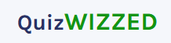
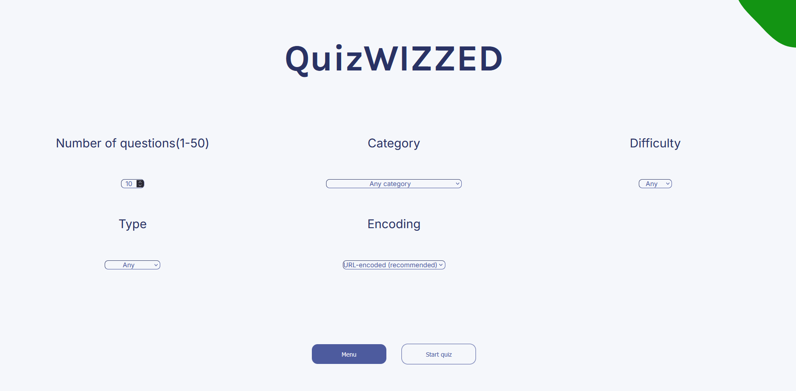

# QuizWizzed

<!-- PROJECT SHIELDS -->
[![Contributors][contributors-shield]][contributors-url]
[![Forks][forks-shield]][forks-url]
[![Stargazers][stars-shield]][stars-url]
[![Issues][issues-shield]][issues-url]
[![LinkedIn][linkedin-shield]][linkedin-url]

<!-- PROJECT LOGO -->
<br />
<div align="center">
  <a href="https://github.com/codingmaniac227/QuizWizzed" target="_blank" rel="noopener">
    
  </a>

  <h3 align="center">QuizWizzed</h3>

  <p align="center">
    A modern trivia app built with React + Vite.<br />
    Configure quiz options (amount, category, difficulty, type, encoding), answer questions, and get instant scoring.
    <br />
    <a href="https://github.com/codingmaniac227/QuizWizzed" target="_blank" rel="noopener"><strong>Explore the docs »</strong></a>
    <br />
    <br />
    <a href="https://quizzwizzed.netlify.app" target="_blank" rel="noopener">View Demo</a>
    ·
    <a href="https://github.com/codingmaniac227/QuizWizzed/issues" target="_blank" rel="noopener">Report Bug</a>
    ·
    <a href="https://github.com/codingmaniac227/QuizWizzed/issues" target="_blank" rel="noopener">Request Feature</a>
  </p>
</div>

---

## Table of Contents
<details>
  <summary>Expand</summary>
  <ol>
    <li><a href="#about-the-project">About The Project</a></li>
    <li><a href="#built-with">Built With</a></li>
    <li><a href="#getting-started">Getting Started</a></li>
    <li><a href="#usage">Usage</a></li>
    <li><a href="#potential-features">Potential Features</a></li>
    <li><a href="#contributing">Contributing</a></li>
    <li><a href="#contact">Contact</a></li>
    <li><a href="#acknowledgments">Acknowledgments</a></li>
  </ol>
</details>

---

## About The Project

<p align="center">
  
</p>

QuizWizzed lets you configure and run trivia rounds sourced from Open Trivia DB. It supports multiple-choice and true/false questions, tracks selections, and provides clear visual feedback with a final score. The app is organized into Start, Options, and Quiz screens, and uses simple, performant UI patterns.

**Highlights**
- Options screen for amount, category, difficulty, type, and encoding
- Clean question rendering with decoded text and answer selection
- Instant scoring and a play-again flow
- Deploy-ready with Netlify

<p align="right">(<a href="#quizwizzed">back to top</a>)</p>

---

## Built With

* [![React][React.js]][React-url]
* [![Vite][Vite.js]][Vite-url]
* Netlify (deployment)
* clsx (conditional class composition)

<p align="right">(<a href="#quizwizzed">back to top</a>)</p>

---

## Getting Started

### Prerequisites
- Node and npm installed

```sh
npm install npm@latest -g
```

### Installation (local)

1. Clone the repo
   ```sh
   git clone https://github.com/codingmaniac227/QuizWizzed.git
   cd QuizWizzed
   ```

2. Install dependencies
   ```sh
   npm install
   ```

3. Run locally
   ```sh
   npm run dev
   # App runs at http://localhost:5173
   ```

<p align="right">(<a href="#quizwizzed">back to top</a>)</p>

---

## Usage

- Open Options, choose your quiz configuration, and start the game.
- Click to select answers. When all questions are answered, check results.
- Review correct answers, see your score, and play again or change options.

Live Demo: <a href="https://quizzwizzed.netlify.app" target="_blank" rel="noopener">https://quizzwizzed.netlify.app</a>

<p align="right">(<a href="#quizwizzed">back to top</a>)</p>

---

## Potential Features

These are optional ideas for future exploration. The current release is complete.

- Timed mode (countdown and time-based scoring)
- Session scoreboard and basic analytics
- Keyboard navigation and enhanced focus states
- Category caching and offline-friendly fallback
- Additional themes, including high-contrast and reduced-motion variants

<p align="right">(<a href="#quizwizzed">back to top</a>)</p>

---

## Contributing

Contributions are welcome.

1. Fork the project  
2. Create your feature branch (`git checkout -b feature/AmazingFeature`)  
3. Commit your changes (`git commit -m 'feat: add AmazingFeature'`)  
4. Push to the branch (`git push origin feature/AmazingFeature`)  
5. Open a Pull Request  

<p align="right">(<a href="#quizwizzed">back to top</a>)</p>

---

## Contact

Marquise Davis – <a href="https://instagram.com/FullStackDemon" target="_blank" rel="noopener">@FullStackDemon</a>  
codingmaniac227@gmail.com  
Project Link: <a href="https://github.com/codingmaniac227/QuizWizzed" target="_blank" rel="noopener">https://github.com/codingmaniac227/QuizWizzed</a>

<p align="right">(<a href="#quizwizzed">back to top</a>)</p>

---

## Acknowledgments

- Open Trivia DB
- React + Vite ecosystem
- Netlify

<p align="right">(<a href="#quizwizzed">back to top</a>)</p>

---

<!-- MARKDOWN LINKS & IMAGES -->
[contributors-shield]: https://img.shields.io/github/contributors/codingmaniac227/QuizWizzed?style=for-the-badge
[contributors-url]: https://github.com/codingmaniac227/QuizWizzed/graphs/contributors
[forks-shield]: https://img.shields.io/github/forks/codingmaniac227/QuizWizzed?style=for-the-badge
[forks-url]: https://github.com/codingmaniac227/QuizWizzed/network/members
[stars-shield]: https://img.shields.io/github/stars/codingmaniac227/QuizWizzed?style=for-the-badge
[stars-url]: https://github.com/codingmaniac227/QuizWizzed/stargazers
[issues-shield]: https://img.shields.io/github/issues/codingmaniac227/QuizWizzed?style=for-the-badge
[issues-url]: https://github.com/codingmaniac227/QuizWizzed/issues
[linkedin-shield]: https://img.shields.io/badge/-LinkedIn-black.svg?style=for-the-badge&logo=linkedin&colorB=555
[linkedin-url]: https://www.linkedin.com/in/marquise-davis/
[React.js]: https://img.shields.io/badge/React-20232A?style=for-the-badge&logo=react&logoColor=61DAFB
[React-url]: https://react.dev/
[Vite.js]: https://img.shields.io/badge/Vite-646CFF?style=for-the-badge&logo=vite&logoColor=FFD62E
[Vite-url]: https://vitejs.dev/
